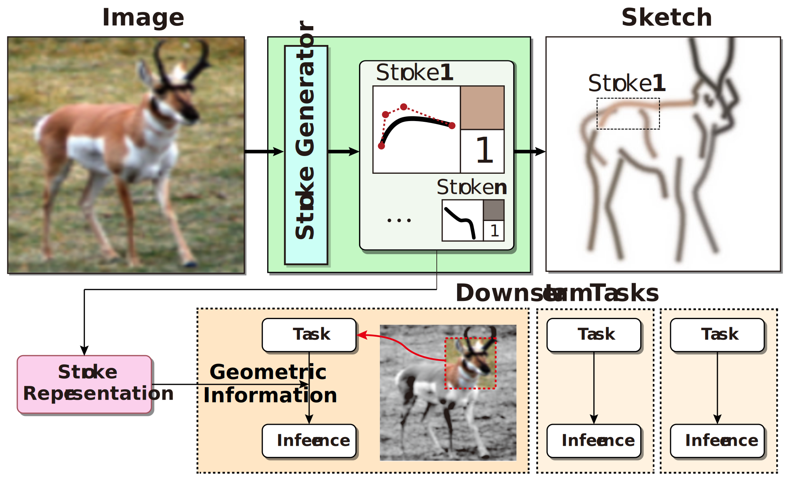
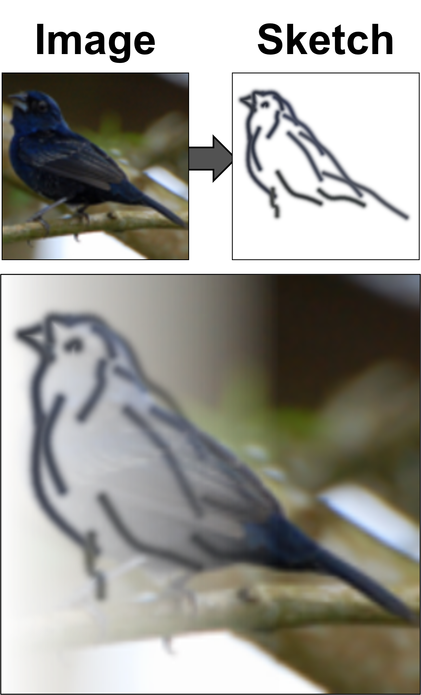
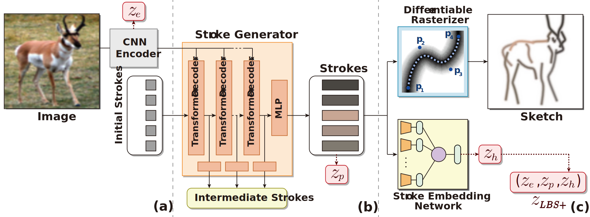

# Learning Geometry-aware Representations by Sketching (CVPR 2023)

[](https://arxiv.org/abs/2304.08204)

This repository contains the pytorch code for reproducing our paper "Learning Geometry-aware Representations by Sketching".

<p align="center">
   
</p>

At a high level, our model learns to abstract an image into a stroke-based color sketch that accurately reflects the geometric information (e.g., position, shape, size).
Our sketch consists of a set of strokes represented by a parameterized vector that specifies their curvature, color, and thickness.
We use these parameterized vectors directly as a compact representation of an image.


## Overview



An overview of LBS(Learning by Sketching), including a CNN-based encoder, Transformer-based Stroke Generator, a Stroke Embedding Network and a Differentiable Rasterizer.

For training, we use CLIP-based perceptual loss, a guidance stroke from optimization-based generation ([CLIPasso](https://github.com/yael-vinker/CLIPasso)).
You can optionally train with an additional loss function specified by the `--embed_loss` argument (`choices=['ce', 'simclr', 'supcon']`).


## Dependencies

Currently, the following environment has been confirmed to run the code:
* python >= 3.7
* pytorch >= 1.10.0

### Install dependencies via pip.

```
# Clone the repo:
git clone https://github.com/illhyhl1111/LearningBySketching.git LBS
cd LBS

# Install dependencies:
pip install -r requirements.txt 
## If pytorch not installed:
pip install torch==1.10.0+cu111 torchvision==0.11.0+cu111 -f https://download.pytorch.org/whl/torch_stable.html

# TODO
git clone https://github.com/BachiLi/diffvg
git submodule update --init --recursive
cd diffvg
python setup.py install
```

### Preparing datasets
By default, the code assumes that all the datasets are located under `./data/`. You can change this path by specifying `--data_root`.

* **STL-10, Rotated MNIST**: will be automatically downloaded.
* **CLEVR dataset**: [download](https://dl.fbaipublicfiles.com/clevr/CLEVR_v1.0.zip) `CLEVR_v1.0.zip`.
  * extract the contents (images, scenes folder) under `--data_root/clevr`.
* **Geoclidean dataset**: [download](https://drive.google.com/file/d/1BbOrU95_bQw4W4yXnnsxPJ58Y7jY2C9q/view?usp=share_link) our realized samples of Geoclidean dataset based on [Geoclidean](https://github.com/joyhsu0504/geoclidean_framework) repo.
  * extract the contents (constraints, elements folder) under `--data_root/geoclidean`.
The structure should be as:
```
--data_dir
├── clevr
│   ├── questions
│   ├── scenes
│   ├── images
│   │   ├── val
│   │   ├── train
│   │   │   ├── CLEVR_train_xxxxxx.png
│   │   │   └── ...
│   │   └── test
│   └── README.txt
└── geoclidean
    ├── constraints
    └── elements
        ├── train
        │   ├── triangle
        │   │   ├── in_xxx_fin.png
        │   │   └── ...
        │   └── ...
        └── test
```

## Scripts

### Generate guidance stroke

To train our model with the CLEVR and STL-10 datasets, you must first generate guidance strokes.

1. You can generate the guidance strokes with:
   - TODO

2. You can download pre-generated strokes from:
   - CLEVR: [link](https://drive.google.com/file/d/1n7cjl5yGaUaeXKURJMwTWGeID-kzKqv_/view?usp=share_link)
   - STL-10: [link](https://drive.google.com/file/d/1UTssJZ89kueJhXubv0s7HPveImBlbOb2/view?usp=share_link)
  
    put the downloaded files into `gt_sketches/`

### Train LBS

``` 
# Rotated MNIST
python main.py --data_root /your/path/to/dir --config_path config/rotmnist.yaml

# Geoclidean-Elements
python main.py --data_root /your/path/to/dir --config_path config/geoclidean_elements.yaml 
# Geoclidean-Constraints
python main.py --data_root /your/path/to/dir --config_path config/geoclidean_constraints.yaml 

# CLEVR
python main.py --data_root /your/path/to/dir --config_path config/clevr.yaml 

# STL-10
python main.py --data_root /your/path/to/dir --config_path config/stl10.yaml 

```

Note: More than 30G of GPU memory is required to run the settings within the default configuration, and multi-GPU via DDP is not currently supported. \
If you run out of memory, we recommend changing --clip_model_name to RN50, reducing --num_aug_clip to reduce the amount of memory used by the CLIP model, or reducing the batch size, but performance may be degraded.

Optional arguments:
* `--embed_loss`: type of $\mathcal{L}_{embed}$, choices: ['none', 'ce', 'simclr', 'supcon']
* `--lbd_g, --lbd_p, --lbd_e`: weights of loss $\mathcal{L}_{guide}, \mathcal{L}_{percept}, \mathcal{L}_{embed}$, respectively
* `--num_strokes`: number of total strokes
  * Changing the number of strokes requires the generation of a corresponding number of guidance strokes.
* `--num_background`: number of strokes assigned to background
* `--enable_color`: enables to learn color-coded strokes (generate black strokes if disabled)
  * `--disable_color`: sets `enable_color` as False
* `--rep_type`: the form of the final representation. options:
  * `LBS+`: $(z_e, z_p, z_h)$
  * `LBS`: $(z_e, z_p)$
  * combinations of 'e', 'p', 'h': Vector concatenating $z_e, z_p, z_h$, respectively. ex) 'ph' -> $(z_p, z_h)$

### Evaluation

```
python evaluate.py logs/{dataset}/{target_folder}
```

## Citation

If you make use of our work, please cite our paper:

```
@misc{lee2023learning,
      title={Learning Geometry-aware Representations by Sketching}, 
      author={Hyundo Lee and Inwoo Hwang and Hyunsung Go and Won-Seok Choi and Kibeom Kim and Byoung-Tak Zhang},
      year={2023},
      eprint={2304.08204},
      archivePrefix={arXiv},
      primaryClass={cs.CV}
}
```